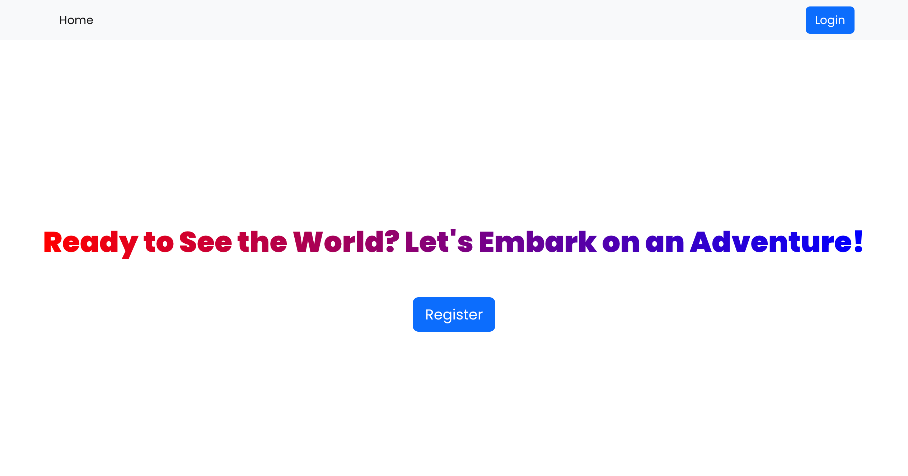
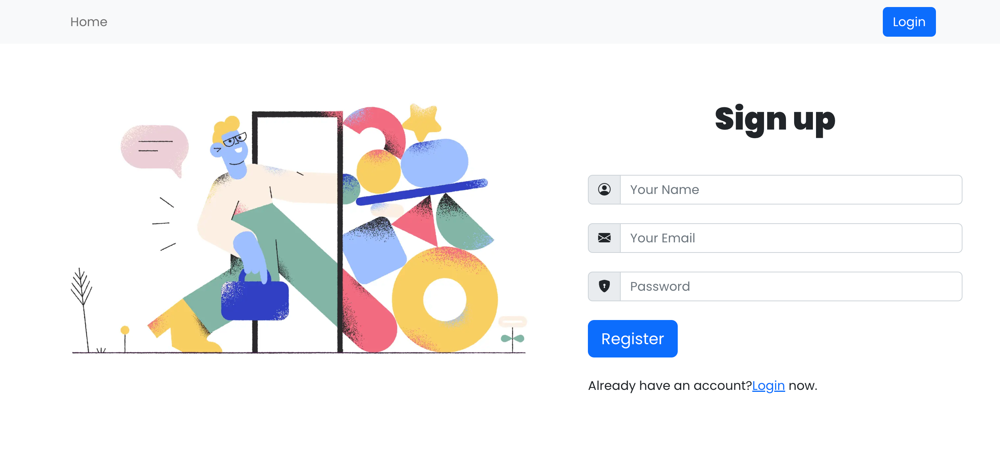
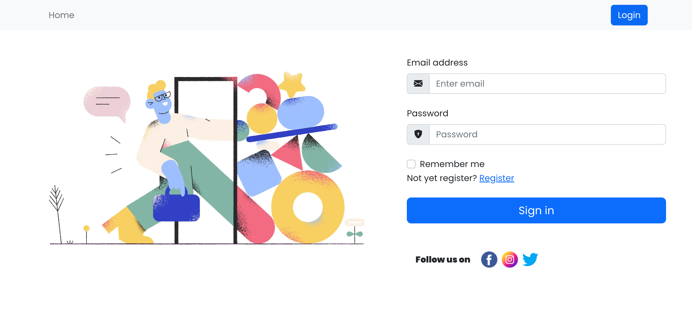
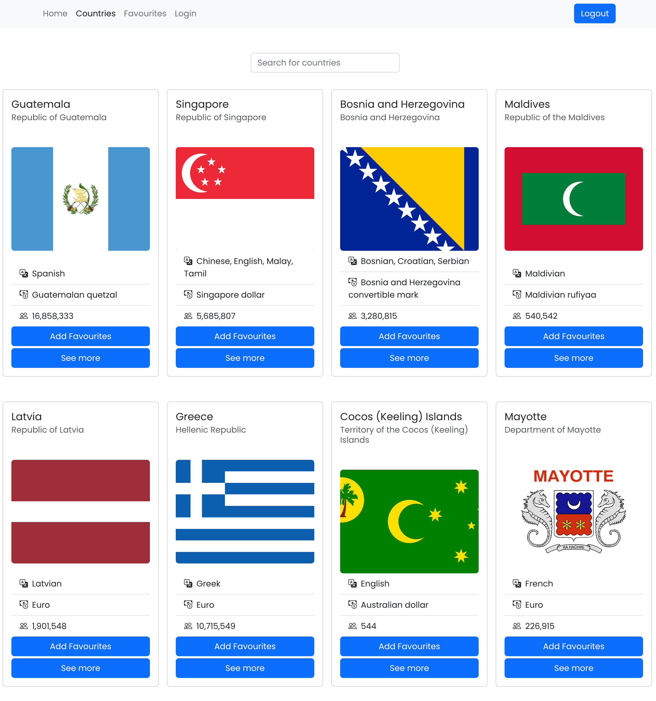

[](https://sonarcloud.io/summary/new_code?id=hasanmd91_countries_app_redux_bootstrap)
[](https://sonarcloud.io/summary/new_code?id=hasanmd91_countries_app_redux_bootstrap)

# Countreis App

This web appliocation has email autitication system
for secure access and a comprehensive list of countries from around the world, complete with detailed information about their geography, history, culture, and weather conditions.

This app allows user to add their favorite countries to a dedicated favorites list for quick and easy access. Plus, they can stay up-to-date on the latest weather conditions in each country.

## Tech Stack

- React
- Redux Toolkit
- Bootstrap
- Css

## Deployment

Live page [here](https://explorecountriesaroundtheglobe.netlify.app/)

## Installation

```bash
  npm install

```

```bash
  npm start

```

## API Reference

#### Get Weather

```http
https://api.openweathermap.org
```

| Parameter | Type     | Description                |
| :-------- | :------- | :------------------------- |
| `api_key` | `string` | **Required**. Your API key |

#### Get Coutries

```http
https://restcountries.com/v3.1/all
```

## Screenshots






## Authors

- GIthub [@hasanmd](https://github.com/hasanmd91)
- Linkdin [@hasanmd](https://www.linkedin.com/in/hasanmd91/)
